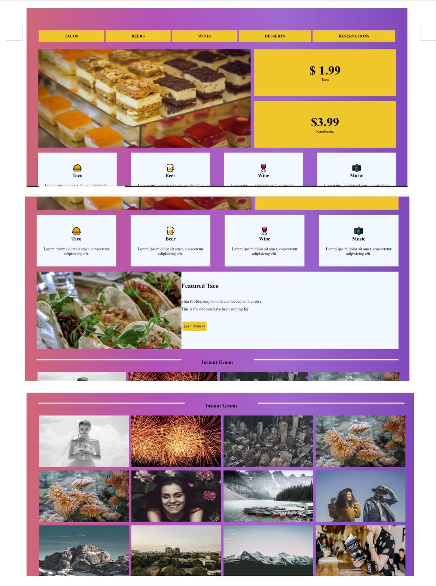

# Assignment of Fontend development HTML CSS BOOTSTRAP AND JAVASCRIPT 

### Assignment one

---
**Screen-Shot of Responsive Design**
---
>Window N Tablet

---
>Mobile

---

### Assignment Two
>Window N Tablet

---

>Mobile

---
### Assignment Three
>using bootstrap desigin
>window

---

### Assignment Four incomplete
>using bootstrap css htm
>window front part

---